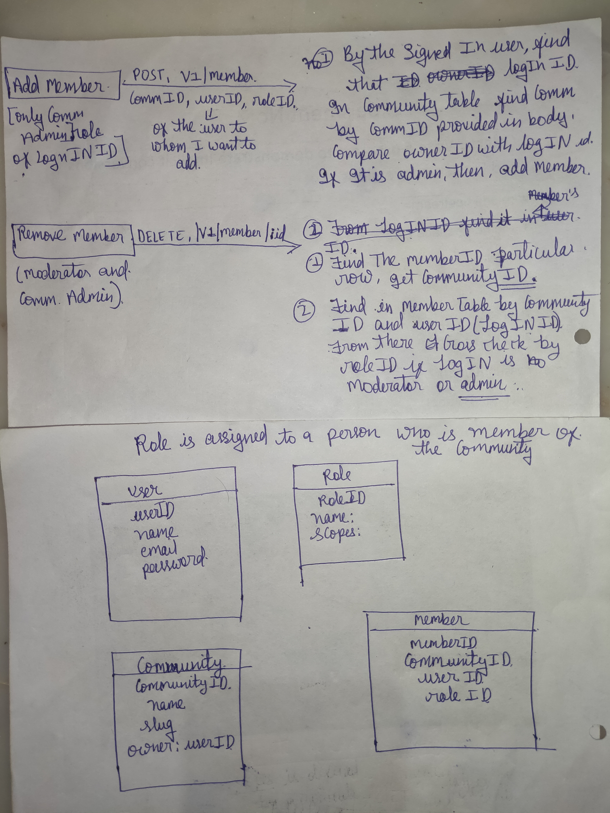

# Info

- The API is Developed In NodeJS & ExpressJs Framework with MongoDB as Database<br>

## Conditions
- All Routes are protected 
- User Email Should be Unique
- A user can't have Two Roles In a Single Community
- A  Community moderator Can remove Community Members But can't remove Community Admin
- <strike> Only A user Who is Commmunity Member can see all Memebers of that Community </strike>
- Any User Can see all Members of any Community 


#  
- [x] Adhered to the response structure.
- [x] Used a database for storing data.
- [x] Connected the database to the application using an ODM.
- [x] The URL for GitLab / GitHub Repository, accessible to public.
- [x] Deployed the code, and the URL is publicly accessible. 
- [x] Library: @theinternetfolks/snowflake to generate unique IDs instead of autoincrement, UUID or MongoDB ObjectID


##  [The API is live Here](https://community-api-zje2.onrender.com/)
##  [You can Interact with The API directly from the Browser By clicking Here ](https://community-api-zje2.onrender.com/api-docs)

<br>

## Features

- MVC Architecture
- Error Handeling
- Modular Code
- Middlewares
- Protected Routes
- Validations
- JWT Authentication
- password Hasing
- Pagination
- Input Validation
- Mongoose Methods
- Mongoose Instances

### Security

- helmet
- cors
- xss-clean
- express-rate-limit
- JWT Authentication
- Password Hashing

## MVC Architecture

- Models - Has All Schemas of Database
- V - view
- Controllers- contain all the functions of all operations

### Routers

- auth.js
- community.js
- member.js
- role.js

#### Register User

- Validate - name, email, password
- No Duplicate email
- Hash Password (with bcryptjs)
- Save User
-
- Send Response

#### Login User

- Validate - email, password - in controller
- If email or password is missing, throw BadRequestError
- Find User
- Compare Passwords
- If no user or password does not match, throw UnauthenticatedError
- If correct, generate Token
- Send Response with Token

#### Monggose Errors Handlers

- Validation Errors
- Duplicate (Email)
- Cast Error

## File Structure

```
└── TIF-Community
    ├── Controllers
    │   ├── auth.js
    │   ├── community.js
    │   ├── member.js
    │   └── role.js
    ├── db
    │   └──connect.js
    ├── errors
    │   ├── index.js
    │   ├── bad-request.js
    │   ├── custom-api.js
    │   ├── not-found.js
    │   └── unauthenticated.js
    ├── Middleware
    │   ├── authentication.js
    │   ├── errror-handler.js
    │   └── not-found.js
    ├── models
    │   ├── Community.js
    │   ├── Member.js
    │   ├── Role.js
    │   └── User.js
    ├── routes
    │   ├── auth.js
    │   ├── community.js
    │   ├── member.js
    │   └── role.js
    ├── utils
    │   ├── index.js
    │   └── Pagination.js
    ├── app.js
    ├── .env
    ├── .gitignore
    ├── swagger.yaml
    ├── TIF-Assignment-Presentation.pdf
    ├── README.MD
    ├── package.json
    └── package-lock.json

```

## Info of All File

- controllers
  - auth -> for SignUP SignIn, Get ME user Functions [JWT Token is sent in case of SIGNUP and  SIGNIN] 
  - community ->  Consists of Create Community, GET all Community, Get All Members of Community, GET My Owned Community and GET My Joined Community  Functionalities
  - member ->  Consists of Add Member and Remove Member Functionalities
  - role ->    Consists of Create Role and GET All Roles
- db
  - Connect -> Connecting to Database
- errors
  - index -> To map all the errors at one place
  - bad-request -> for bad request error
  - not-found -> To handle Not Found
  - unauthenticated -> For Unauthenticated request
  - custom-api -> To Hadle Unknown error
- middleware 
  - authentication -> To Handle User Authorization at each Request
  - errror-handler -> Handle Errors
  - not-found.js -> Handle Unknown Route
- models
  - community ->  Community Table Schema
  - member ->   Member Table Schema
  - role ->    Role Table Schema
  - User ->    User Table Schema
- routes
  - auth -> To redirect Auth EndPoints
  - community ->  To redirect Community EndPoints
  - member ->   To redirect Member EndPoints
  - role ->    To redirect Role EndPoints
- utils
  - Pagination -> Moduler Pagination Code
- app.js -> Our Main File to run the API
- .env -> Our Confidentials Secrets should be saved on server only
- user.json -> Data For user databse
- Community-API Presentation.pdf -> PPT of Working API with Full Functionalities
- README.MD -> All Info about API
- package.json -> Manifesto file for our API node modules
- package-lock.json -> Manifesto file for our API node modules
- #### swagger.yaml ->  Our Interactive API Documentation so users can try out API calls directly from the browser

## Schema


- Registered User Data Schema

```
model user {
  _id        String      @id @default(Snowflake.generate())
  name       String
  email      String          
  password   String       
  createdAt   DateTime   @default(now())
  updatedAt   DateTime   @updatedAt
}
```

- Community Data Schema

```
model Community {
  _id         String      @id @default(Snowflake.generate())
  name        String
  slug        String          
  owner       String       ref: User 
  createdAt   DateTime   @default(now())
  updatedAt   DateTime   @updatedAt
}
```

- Role Data Schema

```
model Role {
  _id         String      @id @default(Snowflake.generate())
  name        String
  scopes      Array                 
  createdAt   DateTime   @default(now())
  updatedAt   DateTime   @updatedAt
}
```

- Member Data Schema

```
model Member {
  _id         String      @id @default(Snowflake.generate())
  community   String      ref: Commmunity
  user        String      ref: User    
  role        String      ref: Role
  createdAt   DateTime   @default(now())
  updatedAt   DateTime   @updatedAt
}
```

## Instructions To run the code

- Please Make sure Node (v18.15.0)  is installed in Your System <br>
- To install the all the data Dependecries <br>
- Run following Commands

```bash
npm install
```

#### Database Connection

1. Schemas are already set Up, Just need to Apply these Models in database<br>
2. In .env file <br>

```
    MONGO_URI=""
    JWT_SECRET=""
    JWT_LIFETIME=""
```

- SetUp MONGO_URI, JWT_SECRET, JWT_LIFETIME with appropriate values.

### Start the server

```bash
npm run dev
```

If You see
"Server is listening on port 3000..." in terminal

- API is ready to run and test

## [ Click Here to See All Functionalities Working ](https://community-api-zje2.onrender.com/api-docs) <br>

## [My All Live Projects Link ](https://linktr.ee/curiousvishu)

## BackGround Rough Work 


